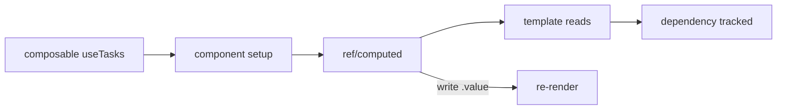

# Reactivity and Composables

## What

Vue's reactivity system tracks which state the template uses and re-renders only when that state changes. Composables are functions that package reactive state with its logic for reuse.

## Why It Matters

Manual DOM updates do not scale — reactivity is what makes declarative templates work. Understanding `ref` tracking and `watch` dependencies explains why some updates propagate and others silently do not. Composables are the Composition API's unit of reuse: they replace the mixins of Vue 2 with explicit, typed imports.

## How It Works

### `ref` — The Default Primitive

```vue
<script setup lang="ts">
import { ref } from 'vue'

const count = ref(0)          // { value: 0 }
count.value++                 // mutate via .value in script

const user = ref<User | null>(null)
</script>

<template>
  <button @click="count++">{{ count }}</button>  <!-- auto-unwrapped -->
</template>
```

Reading `count.value` during render registers a dependency; writing it triggers re-render. In templates, refs auto-unwrap.

### `reactive` vs `ref`

`reactive` proxies an object (no `.value`), but it cannot replace its whole value and loses reactivity when destructured. Use `ref` by default; `reactive` for grouped state that is never replaced wholesale:

```ts
const form = reactive({ email: '', password: '' })
```

### `computed` — Derived State

```ts
const tasks = ref<Task[]>([])
const remaining = computed(() => tasks.value.filter(t => !t.completed).length)
```

Cached, dependency-tracked, and read-only. It is the reactive equivalent of a function returning a value.

### `watch` — Side Effects on Change

```ts
watch(remaining, (newVal, oldVal) => {
  document.title = `(${newVal}) Tasks`
})

// watchEffect: runs immediately, auto-tracks what it reads
watchEffect(() => {
  console.log('remaining:', remaining.value)
})
```

Use `watch` for explicit dependencies with old/new values (API calls on filter change); `watchEffect` for "keep this in sync" effects.

### Composables — Reusable Logic

Extract stateful logic into a function named `use*`:

```ts
// composables/useTasks.ts
export function useTasks() {
  const tasks = ref<Task[]>([])
  const loading = ref(false)

  async function fetchTasks() {
    loading.value = true
    tasks.value = await api.tasks.get()
    loading.value = false
  }

  onMounted(fetchTasks)

  return { tasks, loading, fetchTasks }
}

// in any component
const { tasks, loading } = useTasks()
```

The composable owns the state; each consuming component gets its own instance unless you deliberately share state at module level (that is what Pinia formalizes).



## Common Mistakes

- **Destructuring `props` or `reactive` objects.** It breaks tracking. Destructure `props` via `toRefs(props)`, or read `props.x` directly.
- **Forgetting `.value` in script.** `count++` in script is `NaN`; only templates unwrap.
- **Overusing `watch`.** Derive with `computed` when the output is a value; `watch` is for side effects.
- **Composables with hidden global state.** Module-level `ref` inside `useTasks` shares state across all consumers — a surprise unless intended.
