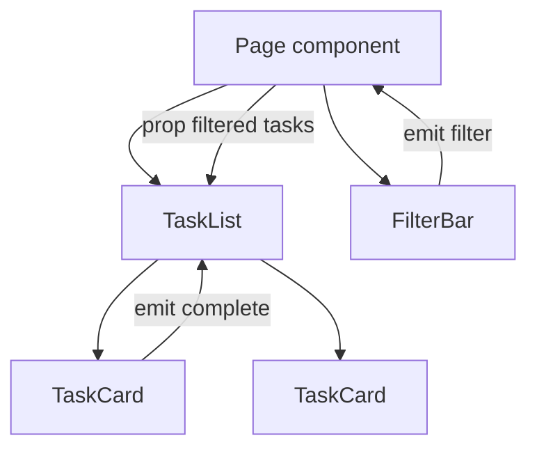

# Components, Props, and Events

## What

Components are the units of a Vue UI. Data flows down through props; intent flows up through emitted events; slots distribute content into a component's layout.

## Why It Matters

Every non-trivial interface is a component tree. Getting the data flow right — props in, events out, never mutating what you do not own — is what keeps a growing frontend debuggable. These rules are identical in spirit to React props/callbacks and to how your Elysia handlers accept typed requests and return typed responses: contracts at every boundary.

## How It Works

### Props In

```vue
<!-- TaskCard.vue -->
<script setup lang="ts">
interface Task {
  id: string
  title: string
  completed: boolean
}

const props = defineProps<{ task: Task }>()
</script>

<template>
  <div class="card" :class="{ done: task.completed }">
    {{ task.title }}
    <button v-if="!task.completed" @click="emit('complete', task.id)">
      Done
    </button>
  </div>
</template>
```

`defineProps` is a compiler macro — no import needed. The prop type is the contract; passing a `Task | null` fails type-check in dev.

### Events Out

```ts
const emit = defineEmits<{
  complete: [taskId: string]
  remove: [taskId: string]
}>()
```

The parent handles the event and owns the state change:

```vue
<TaskCard
  :task="task"
  @complete="tasks.complete($event)"
  @remove="tasks.remove($event)"
/>
```

One-way flow: the child signals, the parent decides.

### Slots — Content Projection

```vue
<!-- Card.vue -->
<template>
  <div class="border rounded-lg p-4">
    <slot name="header" />
    <slot />          <!-- default slot -->
  </div>
</template>

<!-- usage -->
<Card>
  <template #header><h3>Today</h3></template>
  <p>3 tasks remaining</p>
</Card>
```

Slots compose layout; props compose data.

### Cross-Tree State: `provide` / `inject`

For deeply nested values, prop-drilling through five layers is worse than one explicit provider:

```ts
// ancestor
provide('session', readonly(session))   // readonly prevents mutation by children
// descendant
const session = inject<Session>('session')
```

When provide/inject spreads across many components, promote it to a Pinia store.

### Composition Over Configuration



Small components with narrow props beat god-components with twenty of them.

## Common Mistakes

- **Mutating a prop.** `props.task.completed = true` in the child breaks ownership. Emit and let the parent update state.
- **Events carrying objects when an id suffices.** Emit the minimum the parent needs — usually an identifier.
- **Everything through one store.** Local UI state (open/closed, hover) belongs in the component; shared domain state belongs in Pinia.
- **Skipping prop types.** `defineProps<{...}>` gives free compile-time safety — losing it costs hours.
