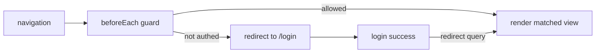

# Vue Router

## What

Vue Router is the official client-side router for Vue SPAs: it maps URLs to components, manages history, and lets navigation trigger logic through guards.

## Why It Matters

A multi-page feel without full page reloads is what makes an SPA feel like an application. The router is also where fullstack concerns surface: deep links must render the right view, protected pages must check auth before rendering, and lazy loading keeps the initial bundle small. Every route you define is the frontend contract of your Elysia API surface.

## How It Works

### Define Routes

```ts
// router/index.ts
import { createRouter, createWebHistory } from 'vue-router'

const router = createRouter({
  history: createWebHistory(),
  routes: [
    { path: '/', name: 'home', component: HomeView },
    { path: '/tasks', name: 'tasks', component: TasksView },
    { path: '/tasks/:id', name: 'task-detail', component: TaskDetailView, props: true },
    { path: '/login', name: 'login', component: LoginView },
    { path: '/:pathMatch(.*)*', name: 'not-found', component: NotFoundView }
  ]
})

export default router
```

`createWebHistory` uses the real History API — clean URLs, no hash.

### Consume Route State

```vue
<script setup lang="ts">
import { useRoute, useRouter } from 'vue-router'

const route = useRoute()    // read-only current route
const router = useRouter()  // navigation API

const taskId = route.params.id as string

function goHome() {
  router.push({ name: 'home' })
}
</script>

<template>
  <RouterLink to="/tasks">Tasks</RouterLink>
  <RouterView />   <!-- matched component renders here -->
</template>
```

`RouterLink` renders an `<a>` that intercepts clicks — no reload.

### Lazy Loading

```ts
{ path: '/tasks', component: () => import('@/views/TasksView.vue') }
```

The chunk loads on first visit. Lazy-load every view except the landing page.

### Navigation Guards — Auth Before Render

```ts
router.beforeEach(async (to) => {
  const auth = useAuthStore()

  if (to.meta.requiresAuth && !auth.isAuthenticated) {
    return { name: 'login', query: { redirect: to.fullPath } }
  }
})
```

Declare the meta flag on protected routes:

```ts
{ path: '/settings', component: SettingsView, meta: { requiresAuth: true } }
```



### Nested Routes

```ts
{
  path: '/settings',
  component: SettingsLayout,
  children: [
    { path: 'profile', component: ProfileSettings },
    { path: 'billing', component: BillingSettings }
  ]
}
```

`SettingsLayout` renders shared chrome plus its own `<RouterView />` for the child.

## Common Mistakes

- **No catch-all route.** Without `/:pathMatch(.*)*`, unknown URLs render a blank `<RouterView>`.
- **Auth checks only in components.** The view flashes before the check runs. Guard at the router.
- **Fetching in guards without handling failure.** A guard that awaits an API which 401s must redirect, not hang.
- **History mode without server fallback.** Deep links like `/tasks/42` must serve `index.html` — configure your host (or Elysia static fallback) for it.
