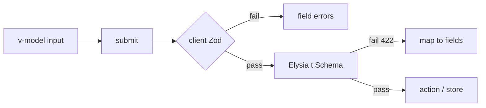

# Forms and Validation

## What

Vue forms bind inputs with `v-model`, validate on submit (or on blur), surface per-field errors, and only call the API when everything passes.

## Why It Matters

Forms are where user data enters your system — and where bad data enters if you are careless. Client validation gives instant feedback; server validation (Elysia `t.Schema`) is the real gate. Doing both, with the same rules, is the difference between a form that feels right and one that produces 400 errors your users never understand.

## How It Works

### Two-Way Binding

```vue
<script setup lang="ts">
import { reactive, ref } from 'vue'

const form = reactive({ email: '', password: '' })
const errors = ref<Record<string, string>>({})
</script>

<template>
  <form @submit.prevent="onSubmit" novalidate>
    <input v-model.trim="form.email" type="email" />
    <p v-if="errors.email" class="error">{{ errors.email }}</p>

    <input v-model="form.password" type="password" />
    <p v-if="errors.password" class="error">{{ errors.password }}</p>

    <button :disabled="submitting">Sign in</button>
  </form>
</template>
```

Modifiers shape input as it binds: `.trim`, `.number`, `.lazy` (sync on change instead of input).

### Validation Rules in a Composable

```ts
// composables/useLoginForm.ts
import { z } from 'zod'

const LoginSchema = z.object({
  email: z.string().email('Enter a valid email'),
  password: z.string().min(8, 'At least 8 characters')
})

export function useLoginForm() {
  const form = reactive({ email: '', password: '' })
  const errors = ref<Record<string, string>>({})

  function validate(): boolean {
    const result = LoginSchema.safeParse(form)
    errors.value = {}
    if (!result.success) {
      for (const issue of result.error.issues) {
        errors.value[issue.path[0] as string] = issue.message
      }
    }
    return result.success
  }

  async function onSubmit() {
    if (!validate()) return
    await useAuthStore().login(form.email, form.password)
  }

  return { form, errors, onSubmit }
}
```

Using the same Zod schema shape as your Elysia `t.Schema` keeps rules aligned — the server schema is the source of truth.

### Submit States

```vue
<template>
  <button :disabled="submitting">
    {{ submitting ? 'Signing in…' : 'Sign in' }}
  </button>
  <p v-if="serverError" class="error">{{ serverError }}</p>
</template>
```

Three states minimum: idle, submitting, and failed-with-message. Disable the button while submitting so double clicks never double-submit.

### Selects and Checkboxes

```vue
<select v-model="form.priority">
  <option value="low">Low</option>
  <option value="high">High</option>
</select>

<input type="checkbox" v-model="form.done" />
<input type="checkbox" v-model="form.tags" value="urgent" />  <!-- array membership -->
```



## Common Mistakes

- **Trusting `type="email"` alone.** Browser validation varies and `novalidate` is common in styled forms. Validate explicitly.
- **Client-only validation.** Every rule on the client must exist on the server — the API is public the moment it ships.
- **Clearing errors only on resubmit.** Clear a field's error the moment the user edits that field.
- **Validating on every keystroke.** Validate on blur or submit, then re-validate as the user fixes the field.
