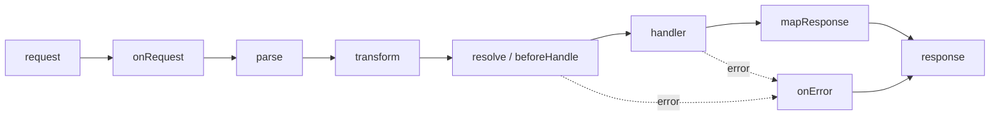

# Elysia Lifecycle and Plugins

## What

Elysia routes run inside a lifecycle — hooks like `onRequest`, `preHandler`, and `onError` run at fixed points around your handlers. Plugins (`.use()`) bundle routes, hooks, and state into reusable modules.

## Why It Matters

Cross-cutting concerns — auth, logging, request context, error mapping — must not be copy-pasted into every handler. Lifecycle hooks give them one interception point; plugins give your API a modular structure that composes without global mutation. This is the same dependency-injection idea you will meet in any serious framework, expressed with functions.

## How It Works

### The Lifecycle



Each hook can short-circuit by returning a value.

### Hooks on a Route

```ts
import { Elysia } from 'elysia'

new Elysia()
  .get('/tasks', ({ tasks }) => tasks.list(), {
    beforeHandle({ headers, set }) {
      if (!headers.authorization) {
        set.status = 401
        return 'Unauthorized'
      }
    }
  })
  .listen(3000)
```

`beforeHandle` runs before the handler — a return value stops the chain.

### Plugins — `plugin()` + `.use()`

```ts
// plugins/auth.ts
import { Elysia, t } from 'elysia'

export const authPlugin = new Elysia({ name: 'auth' })
  .derive(({ headers }) => {
    const token = headers.authorization?.replace('Bearer ', '')
    const user = verifyToken(token)          // throws on bad token
    return { user }
  })

// routes/tasks.ts
import { authPlugin } from '../plugins/auth'

export const taskRoutes = new Elysia({ prefix: '/tasks' })
  .use(authPlugin)
  .get('/', ({ user, tasks }) => tasks.listFor(user.id))
  .post('/', ({ body, user, tasks }) => tasks.create(user.id, body), {
    body: t.Object({ title: t.String() })
  })
```

`derive` adds request-scoped values — every route using the plugin gets `user` for free. `{ name }` makes plugins deduplicate when used twice; `prefix` scopes the routes.

### Mount in the App

```ts
// index.ts
import { Elysia } from 'elysia'
import { taskRoutes } from './routes/tasks'
import { logPlugin } from './plugins/logger'

const app = new Elysia()
  .use(logPlugin)
  .use(taskRoutes)
  .listen(3000)
```

### Global Error Mapping

```ts
new Elysia()
  .onError(({ code, set }) => {
    if (code === 'VALIDATION') {
      set.status = 422
      return { error: 'Invalid request body' }
    }
    if (code === 'NOT_FOUND') {
      set.status = 404
      return { error: 'Route not found' }
    }
    set.status = 500
    return { error: 'Internal error' }
  })
```

One place to shape every error response your API returns.

## Common Mistakes

- **Un-named plugins.** Without `{ name }`, using the same plugin twice doubles its hooks.
- **Business logic in `derive`.** Derive cheap, request-scoped context (current user, db handle) — not workflows.
- **One `index.ts` with 40 routes.** Split by resource into route files with `prefix`; mount them in the app.
- **Recreating the client per request.** MongoDB connections are app-level singletons, not per-request objects.
