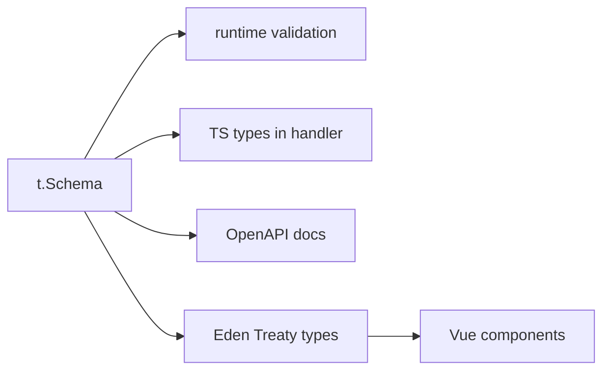

# Type Safety with t.Schema

## What

Elysia's `t` namespace (TypeBox under the hood) declares the shape of request bodies, params, queries, and responses. Validation and static types come from one definition — the runtime rejects what the compiler rejects.

## Why It Matters

Without schema validation, an API trusts whatever arrives over the wire — and TypeScript types vanish at runtime, so `body as CreateTaskDto` is a lie, not a check. With `t.Schema`, one declaration gives you: runtime validation, generated OpenAPI docs, and — through Eden Treaty — types that flow all the way into your Vue components. It is the backbone of end-to-end type safety.

## How It Works

### Validate the Request

```ts
import { Elysia, t } from 'elysia'

const CreateTask = t.Object({
  title: t.String({ minLength: 1, maxLength: 200 }),
  priority: t.Union([t.Literal('low'), t.Literal('high')]),
  dueDate: t.Optional(t.Date())
})

new Elysia()
  .post('/tasks', ({ body, set }) => {
    // body is fully typed AND validated here
    set.status = 201
    return tasks.create(body)
  }, {
    body: CreateTask,
    response: t.Object({
      id: t.String(),
      title: t.String(),
      priority: t.String()
    })
  })
```

Inside the handler, `body.title` is a `string` because Elysia proved it — not because you cast it. Invalid input never reaches your code; it returns a 422 with the failing paths.

### What Each Key Guards

```ts
.get('/tasks/:id', handler, {
  params: t.Object({ id: t.String() }),
  query: t.Object({ page: t.Optional(t.Number()) }),
  headers: t.Object({ authorization: t.String() })
})
```

| Key | Guards |
|-----|--------|
| `body` | JSON body (POST/PUT/PATCH) |
| `params` | Path segments like `:id` |
| `query` | Query string, parsed |
| `headers` | Request headers |
| `response` | What your handler returns |

### Reuse and Compose

```ts
const Task = t.Object({
  id: t.String(),
  title: t.String(),
  completed: t.Boolean()
})

const TaskList = t.Object({
  items: t.Array(Task),
  total: t.Number()
})

.get('/tasks', () => tasks.list(), { response: TaskList })
```

Schemas compose the way types do — define the entity once, reference it everywhere.

### The Payoff: Eden Treaty Types

Because routes carry full schemas, Eden can derive a typed client from the app instance:

```ts
// frontend — types come from the server definition
import { treaty } from '@elysiajs/eden'
import type { App } from 'server/index'

const api = treaty<App>('http://localhost:3000')

const { data, error } = await api.tasks.post({
  title: 'Ship the workshop',
  priority: 'high'
})
```

Rename a field on the server and the frontend fails to compile. No codegen step, no drift.



## Common Mistakes

- **Casting instead of declaring.** `body as CreateTask` skips validation entirely. Declare with `t`, never cast.
- **Validating in the handler.** Manual `if (!body.title) return ...` chains duplicate what `t.Object` does declaratively.
- **Skipping `response` schemas.** Without them, Eden types stay loose and you can leak internal fields accidentally.
- **One giant inline schema per route.** Name and compose schemas like you compose types.
