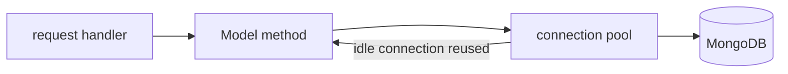

# Connecting MongoDB with Bun

## What

One Mongoose connection, created at app startup from an environment variable, shared by every request. Not per-request, not per-route — a module-level singleton.

## Why It Matters

Connection setup is expensive (TCP handshake, TLS, auth, pool allocation). Opening a connection per request exhausts the database and adds latency to every call. Getting this right once — env-driven, pooled, awaited before serving, closed on shutdown — is the foundation every route with persistence builds on.

## How It Works

### Local MongoDB with Docker

```yaml
# docker-compose.yml
services:
  mongo:
    image: mongo:7
    ports:
      - "27017:27017"
    volumes:
      - mongo-data:/data/db
volumes:
  mongo-data:
```

`docker compose up -d` gives you a local database at `mongodb://localhost:27017`.

### Environment, Not Hardcoding

```bash
# .env
DATABASE_URL=mongodb://localhost:27017/taskapp
```

```ts
// env.ts — fail fast on missing config
if (!process.env.DATABASE_URL) {
  throw new Error('DATABASE_URL is not set')
}
export const DATABASE_URL = process.env.DATABASE_URL
```

Bun loads `.env` automatically — no dotenv package needed.

### The Connection Singleton

```ts
// db.ts
import mongoose from 'mongoose'
import { DATABASE_URL } from './env'

export async function connectDB() {
  await mongoose.connect(DATABASE_URL)
  console.log(`MongoDB connected: ${mongoose.connection.name}`)
}

export async function disconnectDB() {
  await mongoose.disconnect()
}
```

```ts
// index.ts
import { Elysia } from 'elysia'
import { connectDB, disconnectDB } from './db'
import { taskRoutes } from './routes/tasks'

await connectDB()                    // top-level await — Bun supports it

const app = new Elysia()
  .use(taskRoutes)
  .listen(3000)

console.log('API running on http://localhost:3000')

// graceful shutdown — finish in-flight requests, then close
process.on('SIGINT', async () => {
  app.stop()
  await disconnectDB()
  process.exit(0)
})
```

### How the Pool Works



Mongoose maintains a pool (default ~5 connections per process, configurable via the connection string options). Handlers borrow and return pooled connections — you never manage them manually.

### Verify It Works

```bash
bun run index.ts
# MongoDB connected: taskapp
# API running on http://localhost:3000
```

## Common Mistakes

- **Connecting inside a handler or route file that re-runs.** `connectDB()` belongs in the entrypoint, before `.listen()`.
- **Hardcoded URLs.``mongodb://localhost`` in code works locally and breaks in every other environment — and ships credentials when it is a hosted URL.
- **Ignoring SIGTERM/SIGINT.** On shutdown, in-flight writes get cut. Stop the server, disconnect, exit.
- **Mixing `mongodb` driver and Mongoose.** Mongoose wraps the driver; pick Mongoose (schemas, typing, population) and stay with it.
