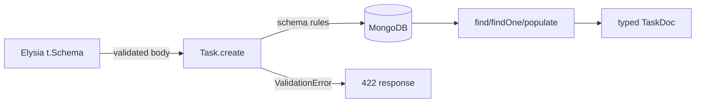

# Mongoose Schemas

## What

A Mongoose schema defines a collection's document shape, field types, validation, and indexes. A model is the constructor compiled from the schema — the typed interface you query with.

## Why It Matters

MongoDB accepts any document. Mongoose schemas put the contract back: invalid fields rejected, required fields enforced, types checked — at the application layer, in TypeScript, with errors your Elysia handlers can map to clean 422 responses. Schemas are where your data-modeling decisions (embed vs reference) become code.

## How It Works

### Define Schema, Create Model

```ts
// models/task.ts
import mongoose, { Schema, type InferSchemaType } from 'mongoose'

const taskSchema = new Schema(
  {
    title: { type: String, required: true, trim: true, maxlength: 200 },
    completed: { type: Boolean, default: false },
    priority: { type: String, enum: ['low', 'high'], default: 'low' },
    dueDate: { type: Date },
    user: { type: Schema.Types.ObjectId, ref: 'User', required: true, index: true }
  },
  { timestamps: true }
)

export const Task = mongoose.model('Task', taskSchema)
export type TaskDoc = InferSchemaType<typeof taskSchema>
```

`timestamps: true` maintains `createdAt`/`updatedAt`. `index: true` on `user` serves "tasks of a user" queries.

### References Between Collections

```ts
// models/user.ts
const userSchema = new Schema({
  email: { type: String, required: true, unique: true, lowercase: true },
  passwordHash: { type: String, required: true },
  name: { type: String, required: true }
})

export const User = mongoose.model('User', userSchema)
```

`ref: 'User'` stores an ObjectId — a reference, resolved on read with `populate`. This mirrors the data-modeling rule: users are shared across tasks, so they are not embedded.

### Query With the Model

```ts
const created = await Task.create({
  title: 'Ship the workshop',
  user: userId
})

const mine = await Task.find({ user: userId })
  .sort({ createdAt: -1 })
  .limit(20)

const one = await Task.findOne({ _id: taskId, user: userId })  // scope every query
if (!one) throw NotFound('Task')
```

### Populate — Resolve References

```ts
const withUser = await Task.findById(id).populate('user', 'email name')
// task.user is now { email, name } instead of an ObjectId
```

Select only the fields the response needs — never `populate` everything blindly.

### Validation Errors Map to API Errors

```ts
try {
  await Task.create(body)
} catch (err) {
  if (err instanceof mongoose.Error.ValidationError) {
    return error(422, Object.values(err.errors).map(e => e.message))
  }
  throw err
}
```



`t.Schema` guards the wire format; the Mongoose schema guards persistence. Both belong in the pipeline.

## Common Mistakes

- **Storing what should be referenced.** `user` embedded in every task duplicates email 10k times. Follow the embed-vs-reference rules from data modeling.
- **Unscoped queries.** `Task.findById(id)` returns anyone's task. Filter by owner: `{ _id: id, user: userId }`.
- **`unique: true` without handling the error.** Duplicate key throws `E11000` — catch it and return 409.
- **Leaning on Mongoose validation alone.** The API boundary still needs `t.Schema` — request shape and storage shape evolve independently.
