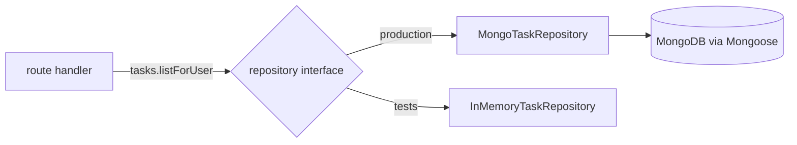

# Repository Pattern

## What

A repository is a class or module that encapsulates all database access for one collection. Handlers and services call repository methods (`findById`, `createForUser`) and never touch Mongoose directly.

## Why It Matters

With models imported anywhere, queries scatter across the codebase — renaming a field means hunting 30 files, and testing a handler needs a real database. A repository concentrates persistence behind a narrow interface: handlers become testable with a fake repo, scoping rules (every query filtered by owner) are written once, and swapping the storage layer touches one file per collection.

## How It Works

### The Repository

```ts
// repositories/task-repository.ts
import type { FilterQuery } from 'mongoose'
import { Task, type TaskDoc } from '../models/task'

export interface TaskRepository {
  listForUser(userId: string): Promise<TaskDoc[]>
  findByIdForUser(id: string, userId: string): Promise<TaskDoc | null>
  create(userId: string, data: CreateTaskInput): Promise<TaskDoc>
  remove(id: string, userId: string): Promise<boolean>
}

export class MongoTaskRepository implements TaskRepository {
  listForUser(userId: string) {
    return Task.find({ user: userId }).sort({ createdAt: -1 }).lean()
  }

  findByIdForUser(id: string, userId: string) {
    return Task.findOne({ _id: id, user: userId }).lean()
  }

  async create(userId: string, data: CreateTaskInput) {
    return Task.create({ ...data, user: userId })
  }

  async remove(id: string, userId: string) {
    const res = await Task.deleteOne({ _id: id, user: userId })
    return res.deletedCount === 1
  }
}
```

Note the shape: methods are named for use cases, not for query mechanics. Scoping by `user` is built into every method — impossible to forget.

### Wire It Into Elysia

```ts
// plugins/repository.ts
import { Elysia } from 'elysia'
import { MongoTaskRepository } from '../repositories/task-repository'

export const repoPlugin = new Elysia({ name: 'repos' })
  .decorate('tasks', new MongoTaskRepository())
```

```ts
// routes/tasks.ts
import { Elysia, t, error } from 'elysia'
import { repoPlugin } from '../plugins/repository'

export const taskRoutes = new Elysia({ prefix: '/tasks' })
  .use(repoPlugin)
  .get('/', ({ tasks, user }) => tasks.listForUser(user.id))
  .delete('/:id', async ({ tasks, user, params }) => {
    const removed = await tasks.remove(params.id, user.id)
    if (!removed) return error(404, 'Task not found')
    return { deleted: true }
  })
```

Handlers read like the use case; persistence details are one `decorate` away.

### Testing With a Fake

```ts
class InMemoryTaskRepository implements TaskRepository {
  store = new Map<string, any>()

  listForUser(userId: string) {
    return [...this.store.values()].filter(t => t.user === userId)
  }
  // ...same interface, no database
}

const repo = new InMemoryTaskRepository()
// inject into the app for tests — routes unchanged
```



## Common Mistakes

- **Repositories that just mirror Mongoose.** `find(query: FilterQuery)` pass-throughs add a layer without adding safety. Methods should express use cases with baked-in scoping.
- **Business logic inside repositories.** A repo fetches and writes; decisions (can this user archive?) belong in the handler/service.
- **One repository for everything.** One per collection — `TaskRepository`, `UserRepository` — keeps interfaces small.
- **Skipping the interface.** The `interface` declaration is what makes the fake swap trivial; without it you are coupled to the class anyway.
