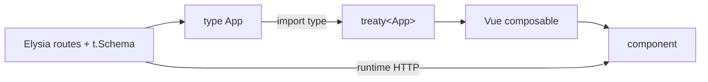

# Eden Treaty with Vue

## What

Eden Treaty is a typed client for Elysia APIs. Point it at your server's `App` type and every call — path, method, body, and response — is checked by TypeScript, with zero code generation.

## Why It Matters

Untyped API calls decay: a renamed field breaks the UI at runtime, in front of a user. With Treaty, server types flow directly into your Vue composables — change a route in Elysia and the frontend fails to compile, not crash. It removes the API-client layer you would otherwise hand-write and maintain.

## How It Works

### Export the App Type

```ts
// server/index.ts
const app = new Elysia()
  .use(authRoutes)
  .use(taskRoutes)
  .listen(3000)

export type App = typeof app
```

### Create the Client

```ts
// frontend/src/api/index.ts
import { treaty } from '@elysiajs/eden'
import type { App } from '../../server/index'

export const api = treaty<App>('http://localhost:3000')
```

The import is types-only — no server code ships to the browser. In a monorepo, frontend and server share the types naturally; in separate repos, a shared types package does the same job.

### Call It — Typed End to End

```ts
const { data, error } = await api.tasks.get()

if (error) {
  console.error(error.value)
  return
}
// data.value: { items: Task[], total: number } — fully inferred
```

Every Treaty call returns `{ data, error, status }`. No thrown exceptions — error handling is explicit.

```ts
await api.tasks.post({
  title: 'Ship the workshop',   // body checked against t.Schema
  priority: 'high'
})
```

A typo like `prioity` is a compile error before it is a bug.

### A Typed Composable

```ts
// frontend/src/composables/useTasks.ts
import { ref } from 'vue'
import { api } from '@/api'

export function useTasks() {
  const tasks = ref<Awaited<ReturnType<typeof fetchTasks>>>([])
  const loading = ref(false)
  const error = ref<string | null>(null)

  async function fetchTasks() {
    loading.value = true
    const { data, error: err } = await api.tasks.get()
    if (err) error.value = 'Failed to load tasks'
    else tasks.value = data.value.items
    loading.value = false
  }

  async function addTask(input: { title: string; priority: 'low' | 'high' }) {
    const { error: err } = await api.tasks.post(input)
    if (!err) await fetchTasks()
  }

  return { tasks, loading, error, fetchTasks, addTask }
}
```



## Common Mistakes

- **Importing server code without `import type`.** It pulls the server (and its deps) into the browser bundle.
- **Ignoring `error` because the demo worked.** Always branch on `error` — network failures, 4xx, and 5xx all arrive there.
- **One giant `api.ts` wrapper.** Treaty is already the client. Wrap per-domain composables (`useTasks`), not Treaty itself.
- **Losing types through `any`.** `const { data }: any = ...` discards everything Treaty bought you.
