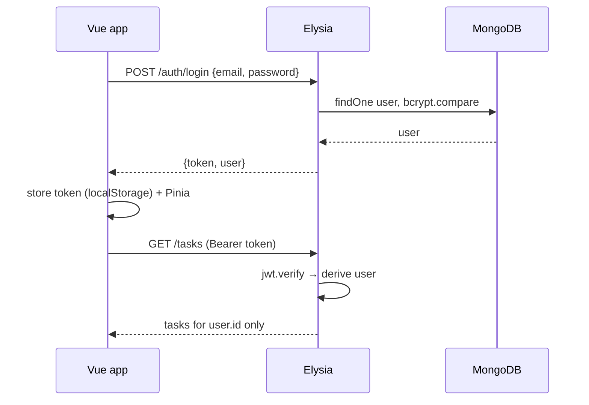

# Auth Flow with JWT

## What

JWT auth connects three pieces: Elysia issues a token at login and verifies it on protected routes; the Vue app stores the token, sends it with every request, and guards routes that require a session.

## Why It Matters

Auth is the first feature every real app needs and the first place security mistakes hurt. Getting the full loop right — password hashing, token issuance, verification middleware, client storage, redirect-back-after-login — is a milestone: after this, protected routes and per-user data are routine plumbing.

## How It Works

### Server: Issue at Login

```ts
// routes/auth.ts
import bcrypt from 'bcryptjs'
import jwt from 'jsonwebtoken'

export const authRoutes = new Elysia({ prefix: '/auth' })
  .post('/login', async ({ body, set }) => {
    const user = await User.findOne({ email: body.email })
    const valid = user && await bcrypt.compare(body.password, user.passwordHash)
    if (!valid) return error(401, 'Invalid credentials')

    const token = jwt.sign(
      { sub: user.id, email: user.email },
      process.env.JWT_SECRET!,          // env, never in code
      { expiresIn: '1h' }
    )
    return { token, user: { id: user.id, email: user.email, name: user.name } }
  }, {
    body: t.Object({ email: t.String(), password: t.String() })
  })
```

### Server: Verify on Protected Routes

```ts
// plugins/auth.ts
export const authPlugin = new Elysia({ name: 'auth' })
  .derive(({ headers }) => {
    const token = headers.authorization?.replace('Bearer ', '')
    if (!token) throw new Error('UNAUTHORIZED')
    try {
      const payload = jwt.verify(token, process.env.JWT_SECRET!)
      return { user: { id: payload.sub as string, email: payload.email as string } }
    } catch {
      throw new Error('UNAUTHORIZED')
    }
  })
```

Routes that `.use(authPlugin)` get `user` in scope — and 401s for missing or expired tokens via `onError`.

### Client: Store, Send, Guard

```ts
// stores/auth.ts — Pinia store
export const useAuthStore = defineStore('auth', () => {
  const token = ref(localStorage.getItem('token'))
  const user = ref<User | null>(null)
  const isAuthenticated = computed(() => !!token.value)

  async function login(email: string, password: string) {
    const { data, error } = await api.auth.login({ email, password })
    if (error) throw new Error('Invalid credentials')
    token.value = data.token
    user.value = data.user
    localStorage.setItem('token', data.token)
  }

  function logout() {
    token.value = null
    user.value = null
    localStorage.removeItem('token')
  }

  return { token, user, isAuthenticated, login, logout }
})
```

Attach the token to every request with an Eden `onRequest` interceptor (or fetch wrapper): `headers.authorization = \`Bearer ${token}\``.

Guard the router:

```ts
router.beforeEach((to) => {
  const auth = useAuthStore()
  if (to.meta.requiresAuth && !auth.isAuthenticated) {
    return { name: 'login', query: { redirect: to.fullPath } }
  }
})
```

### The Full Loop



## Common Mistakes

- **Storing passwords.** Hash with bcrypt, compare hashes — never store or log plaintext.
- **JWT_SECRET in code or defaulting it.** `'secret'` as a fallback ships to production. Fail fast if unset.
- **Putting roles or PII in the token payload.** It is base64, readable by anyone holding it. Keep claims minimal (`sub`, expiry).
- **Client-only protection.** Router guards improve UX; the server verifies every request regardless.
- **No expiry.** A stolen token without `expiresIn` is permanent access. Short-lived access tokens (+ refresh flow) are the standard fix.
