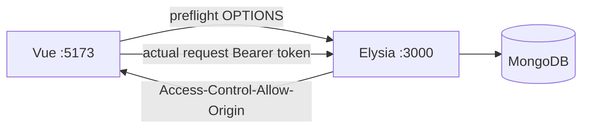

# CORS and Environment Config

## What

CORS (Cross-Origin Resource Sharing) lets a browser app on one origin call an API on another. Environment configuration keeps per-environment values — URLs, ports, secrets — out of the code, loaded at runtime.

## Why It Matters

In development, Vue runs on `:5173` and Elysia on `:3000` — different origins. Without CORS headers the browser blocks every API call with a confusing network error. In production, origins, credentials, and secrets differ per environment; hardcoding any of them means a deploy-time surprise. These are small settings with outsized blast radius — learn them once, configure them everywhere.

## How It Works

### Enable CORS on Elysia

```ts
import { cors } from '@elysiajs/cors'

const app = new Elysia()
  .use(cors({
    origin: /^.*\.localhost:\d+$/,       // dev: Vite's origin
    // origin: 'https://app.example.com', // prod: the real frontend
    credentials: true
  }))
```

`origin` accepts a string, regex, or function. Listing real origins (instead of `true` = allow-all) is what makes credentialed cross-origin requests safe.

### Two Ways to Handle Dev Origins

| Approach | Config | Best for |
|----------|--------|----------|
| CORS on the server | enable plugin, list origins | realistic — matches prod behavior |
| Vite dev proxy | `/api` proxies to `:3000` | zero CORS in dev, same-origin requests |

```ts
// frontend/vite.config.ts — proxy alternative
export default defineConfig({
  server: {
    proxy: {
      '/api': {
        target: 'http://localhost:3000',
        rewrite: path => path.replace(/^\/api/, '')
      }
    }
  }
})
```

With the proxy, the browser only ever sees same-origin `/api/...` calls — CORS never triggers in development.

### Environment Config

```bash
# server/.env
PORT=3000
DATABASE_URL=mongodb://localhost:27017/taskapp
JWT_SECRET=dev-secret-change-me

# frontend/.env
VITE_API_URL=http://localhost:3000
```

Rules of the game:

- Bun and Vite load `.env` automatically — no dotenv in code.
- Only `VITE_*` variables reach the frontend bundle. Everything else is build-time invisible to the browser.
- `.env` is gitignored; commit `.env.example` with the keys and no values.

Fail fast on missing config:

```ts
// server/env.ts
function required(name: string): string {
  const value = process.env[name]
  if (!value) throw new Error(`Missing env: ${name}`)
  return value
}

export const env = {
  port: Number(process.env.PORT ?? 3000),
  databaseUrl: required('DATABASE_URL'),
  jwtSecret: required('JWT_SECRET')
}
```

```ts
// frontend/src/api/index.ts
export const api = treaty<App>(import.meta.env.VITE_API_URL)
```



## Common Mistakes

- **`origin: true` in production.** Allow-all with credentials invites CSRF-style abuse. List real origins.
- **Solving CORS with browser flags or disabling security.** The server must send the headers — there is no client-side fix.
- **Frontend reading `process.env`.** In Vite it is `import.meta.env`, and only `VITE_*` vars exist there.
- **Committing real secrets.** `.env.example` is the template; actual `.env` files never enter git.
