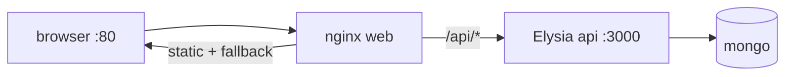

# Deployment with Docker

## What

Production deployment for this stack is two containers — Vue static files served by a web server, Elysia running the API — plus MongoDB, expressed in one Dockerfile per app and one Compose file that ties them together.

## Why It Matters

"It works on my machine" ends at deployment. Docker freezes the runtime: the same Bun version, the same build steps, the same env contract — on your laptop, CI, and the host. Multi-stage builds keep images small; Compose models the whole system (frontend, API, database) as one runnable unit.

## How It Works

### Elysia Dockerfile

```dockerfile
# server/Dockerfile
FROM oven/bun:1 AS base
WORKDIR /app

# install deps first — cached unless package.json changes
COPY package.json bun.lock ./
RUN bun install --frozen-lockfile

COPY . .

FROM base AS runtime
EXPOSE 3000
CMD ["bun", "run", "index.ts"]
```

### Vue Dockerfile — Multi-Stage

```dockerfile
# frontend/Dockerfile
FROM oven/bun:1 AS build
WORKDIR /app
COPY package.json bun.lock ./
RUN bun install --frozen-lockfile
COPY . .
RUN bun run build

FROM nginx:alpine
COPY --from=build /app/dist /usr/share/nginx/html
COPY nginx.conf /etc/nginx/conf.d/default.conf
EXPOSE 80
```

Build happens in the container; the final image ships only static files and nginx.

### nginx — Static + History Fallback + API Proxy

```nginx
server {
  listen 80;

  location / {
    root /usr/share/nginx/html;
    try_files $uri $uri/ /index.html;   # SPA deep links
  }

  location /api/ {
    proxy_pass http://api:3000/;        # compose service name
    proxy_set_header Host $host;
  }
}
```

With `/api` proxied same-origin, production needs no CORS at all — the same pattern as the dev proxy.

### Compose the Whole System

```yaml
# docker-compose.yml
services:
  mongo:
    image: mongo:7
    volumes:
      - mongo-data:/data/db

  api:
    build: ./server
    environment:
      DATABASE_URL: mongodb://mongo:27017/taskapp
      JWT_SECRET: ${JWT_SECRET}
    depends_on:
      - mongo

  web:
    build: ./frontend
    ports:
      - "80:80"
    depends_on:
      - api

volumes:
  mongo-data:
```



### Run It

```bash
docker compose up --build
# web on :80, api reachable through /api
```

On a host without Compose, the same images run anywhere containers do — a VPS, Cloud Run, or a Kubernetes pod.

## Common Mistakes

- **Baking secrets into images.** `ENV JWT_SECRET=x` in a Dockerfile ships the secret in the image layers. Inject at runtime via Compose environment or the orchestrator.
- **Copying `node_modules` from the host.``COPY . .` includes it via `.dockerignore` accidents — add `node_modules`, `.env`, and `dist` to `.dockerignore`.
- **No history fallback.** Deep links 404 without `try_files ... /index.html`.
- **One container running both frontend and API "to keep it simple".** It couples deploy cycles and resource profiles — two containers is the simple version long-term.
- ** prod database inside the app container.** Use Atlas or a managed MongoDB for real traffic; Compose Mongo is for dev.
